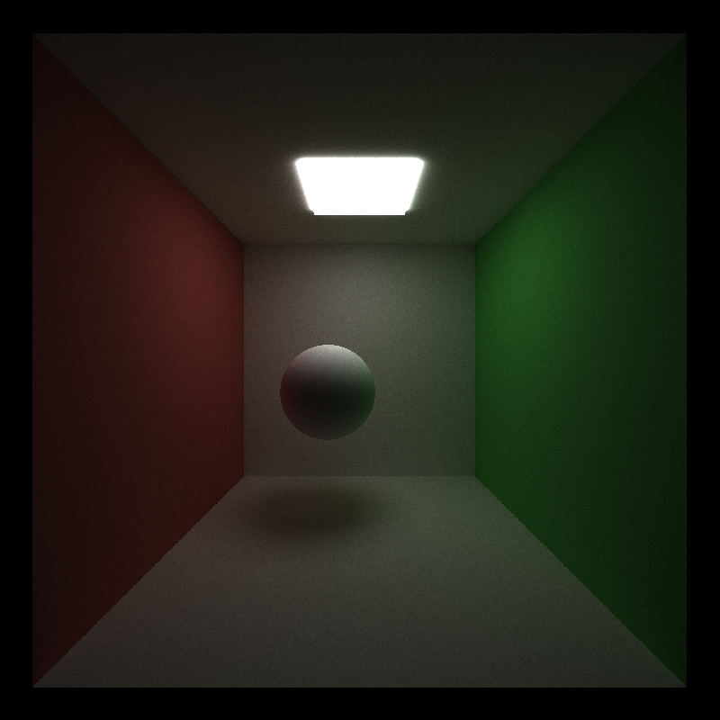
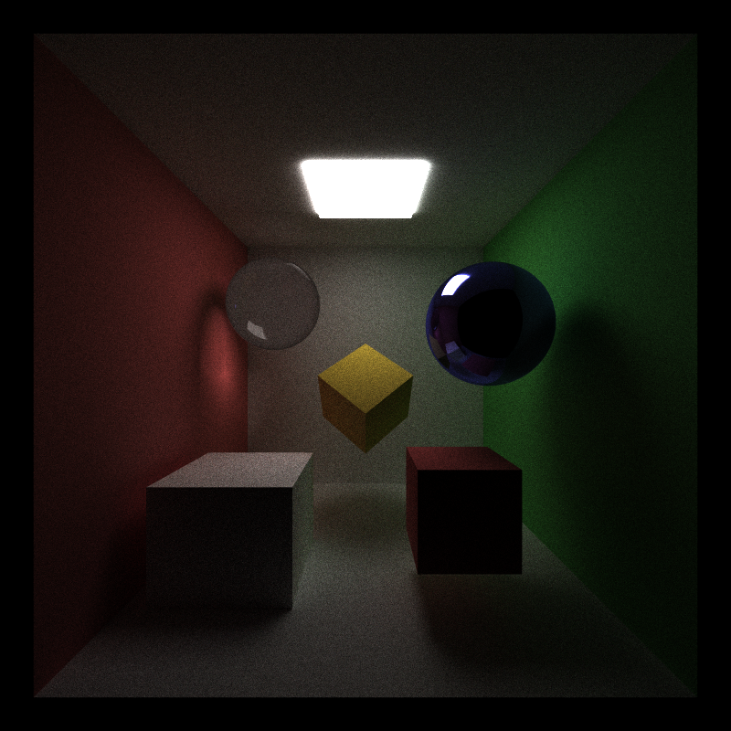
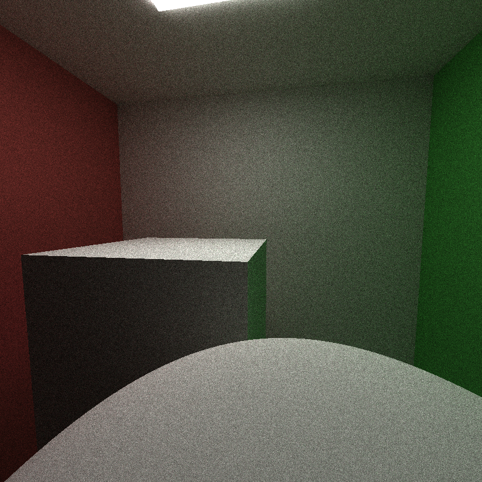
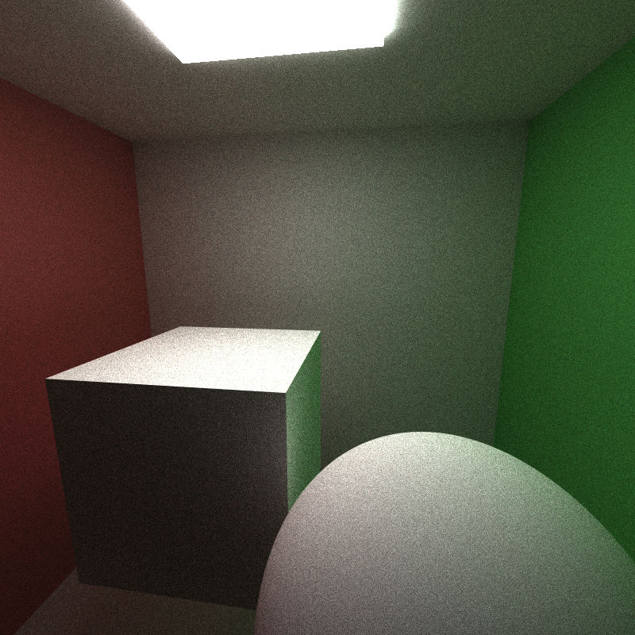
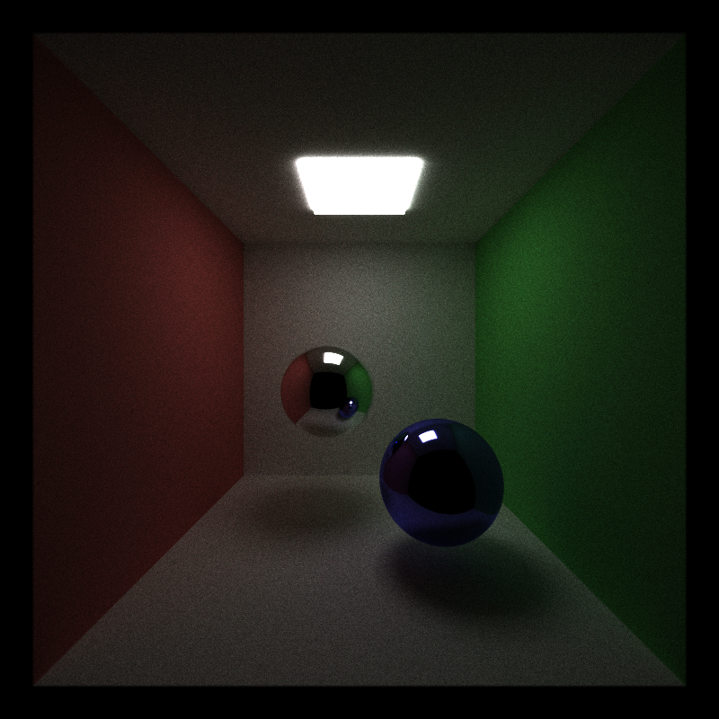
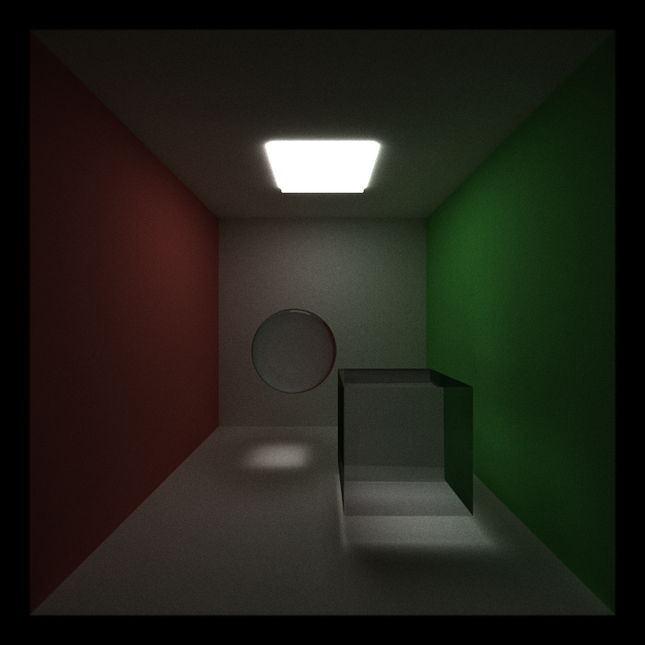
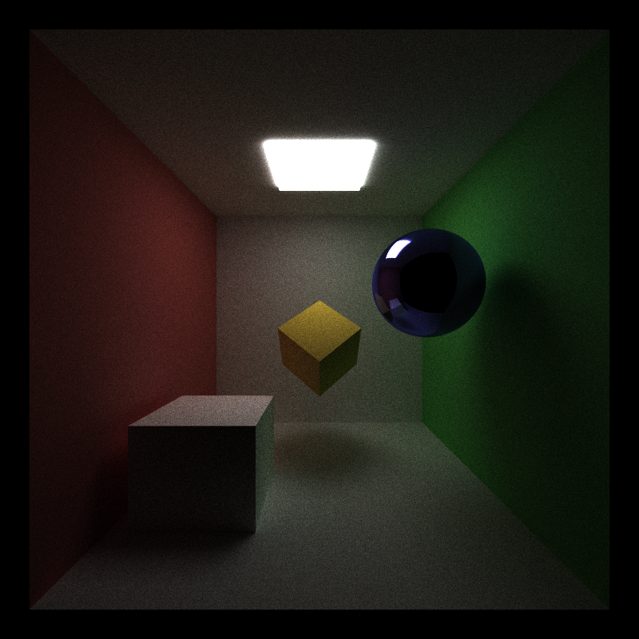
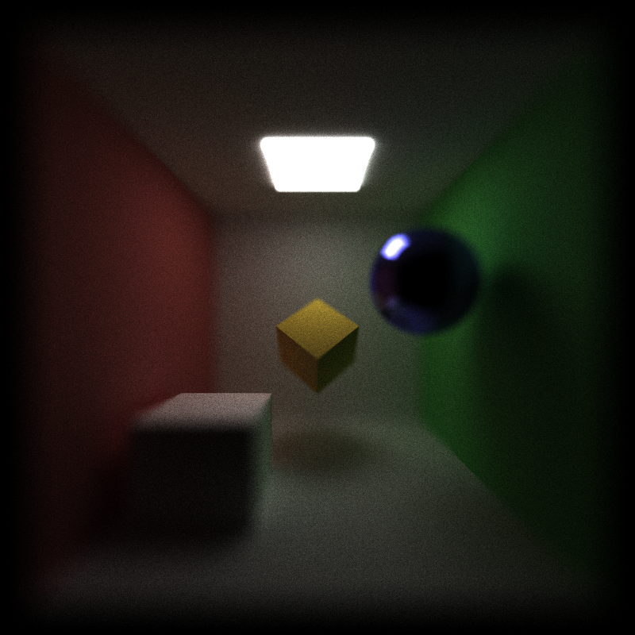
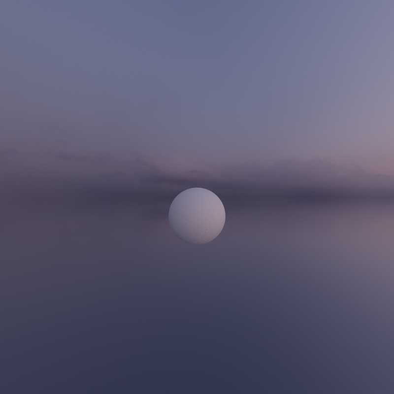
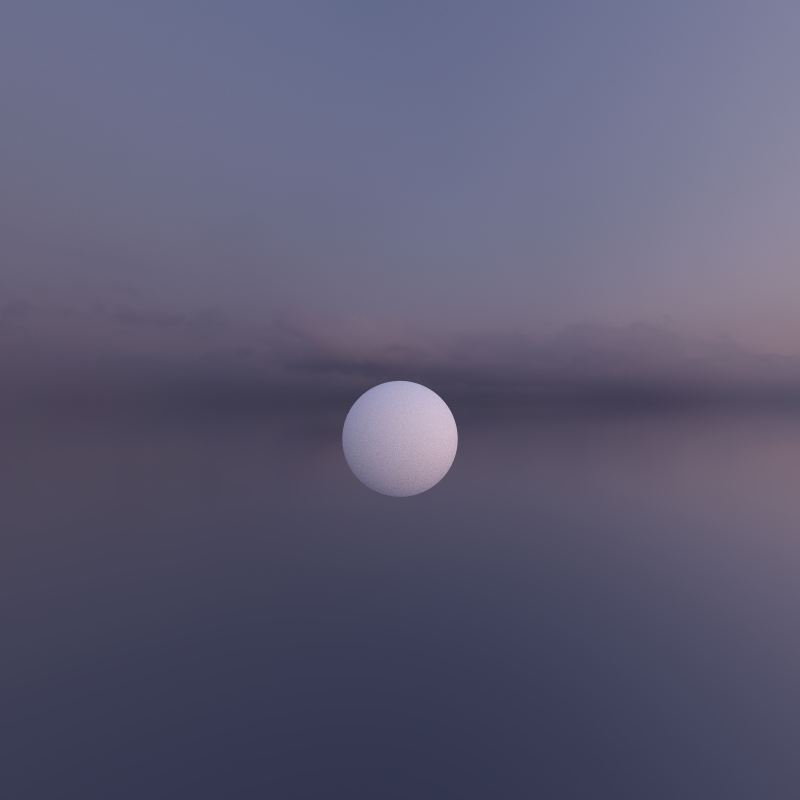

CUDA Path Tracer
================

**University of Pennsylvania, CIS 565: GPU Programming and Architecture, Project 3**

* Christina Qiu
  * [LinkedIn](https://www.linkedin.com/in/christina-qiu-6094301b6/), [personal website](https://christinaqiu3.github.io/), [twitter](), etc.
* Tested on: Windows 11, Intel Core i7-13700H @ 2.40GHz, 16GB RAM, NVIDIA GeForce RTX 4060 Laptop GPU (Personal laptop)

## Overview

This is an implementation of CUDA Path Tracer.

Base Features:

* Ideal diffuse BSDF using cosine-weighted scattering.
* Core path tracer with shading kernel.
* Contiguous memory layout for path segments by material type.
* Stochastic antialiasing via jittered sampling.

Extra Features:

* Visual Improvments
 * 2️⃣ Refraction (e.g. glass/water) with Frensel effects using Schlick's approximation and glm::refract for Snell's law.
 * 2️⃣ Physically-based depth-of-field (by jittering rays within an aperture).
 * 4️⃣ Subsurface scattering.
 * 2️⃣ Environment map lighting.
* Mesh Improvments
 * 4️⃣ glTF arbitrary mesh loading and rendering.

credit third party code: stb_image.h, stb_image_write.h, json.hpp and tiny_gltf.h.

## Diffuse BSDF with Cosine-Weighted Sampling


The diffuse component models light that is scattered uniformly in all directions from a rough surface. This is implemented using the Lambertian reflectance model, where the outgoing radiance is proportional to the cosine of the angle between the surface normal N and the light direction L:
```
Lo = kd * Li * max(0, dot(N, L))
```
Here, kd is the diffuse reflectance (albedo) and Li is the incident light intensity. This produces a matte appearance where brightness depends solely on the orientation of the surface relative to the light source.

In a path tracer, diffuse scattering is sampled using cosine-weighted hemisphere sampling, which preferentially generates rays in directions closer to the normal to match the Lambertian cosine law:
```
vec3 sampleDir = calculateCosineWeightedDirection(N, rng);
vec3 scatteredRay = hitPos + epsilon * N;
color = albedo * traceRay(scatteredRay, sampleDir);
```
Cosine-weighted sampling improves convergence by giving more samples to directions that contribute more to the reflected radiance, reducing variance compared to uniform hemisphere sampling.

[PBRTv4 9.2](https://pbr-book.org/4ed/Reflection_Models/Diffuse_Reflection)

## Contiguous Memory Layout by Material Type
| Material sorting off: 46.095 ms/frame, 21.7 FPS | Material sorting on: 147.893 ms/frame, 6.7 FPS |
|----------|-------------|
|  |  |

6 material types: emitting, diffuse, specular, refractive, subsurface, reflective

The slowdown in frame time likely occurs because the overhead of sorting paths outweighs the benefits when only a small number of material types is present. For scenes with more materials or deeper bounces, sorting may provide better memory coalescing and reduced branch divergence, but in this test, the performance trade-off was not worth it.

To maximize GPU efficiency, path segments are stored in contiguous blocks by material ID. After each bounce, terminated paths are removed via stream compaction, and the remaining paths are sorted by material using thrust::sort_by_key. This produces a memory layout like:
```
[material 0 paths][material 1 paths][material 2 paths] ...
```
Benefits of this approach:

* Memory coalescing: Threads processing paths of the same material access consecutive memory addresses, improving cache performance and GPU throughput.
* Material-based shading: All paths for a given material can be processed in a single kernel launch, reducing branch divergence and kernel overhead.
* Compact active paths: Combined with stream compaction, only active paths remain in memory, maximizing utilization.

This design ensures that shading operations are both efficient and parallel-friendly, which is critical for high-performance path tracing on the GPU.

## Stochastic Antialiasing via Jittered Sampling
| Before | After |
|----------|-------------|
|  |  |

To reduce aliasing artifacts, each pixel is sampled multiple times with sub-pixel jittered offsets. Rather than sampling at the exact pixel center, the ray origin is randomly perturbed within the pixel footprint for each sample.

This stochastic sampling produces a Monte Carlo estimate of the pixel color:
```
color_pixel ≈ (1 / N) * Σ_i=1^N traceRay(ray_i)
```
where ray_i originates from a slightly different position inside the pixel. Averaging multiple samples smooths edges, reduces jaggedness, and produces visually accurate antialiasing.

This approach is efficient on the GPU because each sample is independent and fully parallelizable, enabling high-quality antialiasing without significant memory overhead.

[notes](https://paulbourke.net/miscellaneous/raytracing/)

## Specular Materials


The specular component represents mirror-like reflection of light from smooth surfaces. At each intersection point, the outgoing reflection ray R is computed using the incident view direction V and surface normal N:
```
R = V - 2 * dot(V, N) * N
```
The reflected color is then obtained by recursively tracing a new ray along R:
```
vec3 R = reflect(ray.dir, N);
color = traceRay(hitPos + eps * R, R);
```
For physically-based blending, Fresnel reflectance is applied to interpolate between diffuse and reflected light contributions:
```
F = (1 - cos(theta))^5
Lo = (1 - F) * L_diffuse + F * L_reflected
```
where theta is the angle between V and N. Incorrect normal orientation or coordinate inversion can result in flipped reflections, while missing intersection returns can appear as black outlines.

[PBRTv4 9.3](https://pbr-book.org/4ed/Reflection_Models/Specular_Reflection_and_Transmission)

## Refraction with Frensel


Refraction models light transmission through transparent materials such as glass or water. The direction of the transmitted ray T is determined by Snell’s Law:

T = eta * I - (eta * dot(I, N) + sqrt(1 - eta^2 * (1 - dot(I, N)^2))) * N

where
* I is the incident ray direction
* N is the surface normal
* eta = n1 / n2 is the ratio of refractive indices (e.g., air to glass).

In code:
```
float eta = outsideIOR / insideIOR; // e.g., 1.0 / 1.5
vec3 T = refract(ray.dir, N, eta);
color = traceRay(hitPos + eps * T, T);
```
The Fresnel term, approximated using Schlick’s approximation, controls the ratio of reflected and refracted light based on the incident angle:

F = F₀ + (1 - F₀) * (1 - cosθ)⁵, F₀ = ((n1 - n2) / (n1 + n2))²

The final color is computed by combining reflection and transmission:

Lo = F * L_reflected + (1 - F) * L_refracted

This produces realistic glass behavior, with strong reflections at grazing angles and accurate light bending caused by refraction through the curved surface.

[Schlick's approximation](https://en.wikipedia.org/wiki/Schlick's_approximation)

## Physically-Based Depth of Field
| lensRadius = 0.f | lensRadius = 1.f |
|----------|-------------|
|  |  |


Depth-of-field simulates the optical effect of a camera lens, where objects at the focal distance appear sharp, while objects closer or farther away appear blurred. This is achieved by jittering rays within a lens aperture to mimic the effect of a finite lens size.

For each ray:

Compute the point on the focal plane:
```
ft = focalDistance / dot(viewDir, rayDir)
pFocus = camPosition + ft * rayDir
```
Randomly sample a point on the lens disk:
```
pLens = lensRadius * sampleUniformDiskConcentric(u1, u2)
```
Offset the ray origin by this lens sample and adjust the ray direction to point toward the focal point:
```
rayOrigin += pLens.x * right + pLens.y * up
rayDirection = normalize(pFocus - rayOrigin)
```
This produces a Monte Carlo estimate of the blurred image, where averaging multiple rays per pixel naturally generates the depth-of-field effect.

For a pinhole camera (lens radius = 0), rays pass directly through the camera origin without offset, producing perfectly sharp images.

This physically-based method ensures that objects at the focal distance are in focus while others blur realistically according to their distance from the lens.

[PBRTv4 5.2.3](https://pbr-book.org/4ed/Cameras_and_Film/Projective_Camera_Models#TheThinLensModelandDepthofField)

## Subsurface Scattering
| Diffuse | Subsurface |
|----------|-------------|
|  |  |

Subsurface scattering (SSS) simulates light penetrating a surface, scattering internally, and exiting at a different point. This produces the soft, translucent appearance seen in materials like skin, wax, or marble.

In the renderer, I approximate SSS by perturbing the light direction inside the material and attenuating the contribution based on thickness, distortion, and scattering scale:
```
float sss = subsurface(lightDir, normal, viewVec, thickness, material);
color += albedo * sss;
```
This method captures the characteristic glow and soft shading of translucent surfaces without the full computational cost of volumetric simulation.

[PBRTv3 5.6.2](https://www.pbr-book.org/3ed-2018/Color_and_Radiometry/Surface_Reflection#TheBSSRDF), [11.4](https://www.pbr-book.org/3ed-2018/Volume_Scattering/The_BSSRDF.html)

## Environment Map Lighting
Environment map lighting uses a 360° texture to provide illumination from the surrounding scene, simulating realistic ambient light and reflections.

Rays that miss scene geometry sample the environment map based on their direction to determine incoming light:
```
vec3 envColor = sampleEnvironment(rayDirection);
color += throughput * envColor;
```
To achieve full spherical coverage, the ray direction is converted to spherical coordinates (θ, φ) and mapped to UV coordinates on the environment texture. The texture is loaded using stb_image, supporting formats like PNG and HDR.

## glTF Arbitrary Mesh Loading and Rendering

Meshes are loaded from glTF or GLB files using the TinyGLTF library, which supports both ASCII (.gltf) and binary (.glb) formats. Each model may contain multiple nodes, each referencing a mesh, which in turn can have multiple primitives. Each primitive stores vertex attributes such as positions, normals, texture coordinates, and indices.

In my implementation, memory is dynamically allocated for each mesh’s vertex and index data. For each node containing a mesh:

* Retrieve the node’s local transformation.
* Iterate through all primitives.
* Extract the "POSITION" attribute from the accessor, apply the node transform, and store in a vertex buffer.
* Extract indices from the primitive, correctly handling unsigned byte, unsigned short, or unsigned int component types.
* Allocate memory for a Mesh structure and copy the vertex and index data.

To accelerate ray-mesh intersection, bounding volume intersection culling is implemented using an axis-aligned bounding box (AABB) per mesh. Each ray first tests against the mesh’s AABB (intersectAABB). If the ray intersects the bounding box I iterate over individual triangles with intersectRayTriangle.

This significantly reduces the number of triangle intersection tests, particularly for large meshes or rays that miss the mesh entirely. On the GPU, this is efficient because many rays can be tested in parallel, while avoiding unnecessary work for triangles outside the bounding volume.

Example pseudocode from my implementation:
```
if (USE_AABB_CULLING) {
    float t0, t1;
    if (!intersectAABB(ray, mesh.bbox, t0, t1)) return false;
}

for (int i = 0; i < mesh.indexCount; i++) {
    glm::ivec3 tri = mesh.indices[i];
    if (intersectRayTriangle(ray.origin, ray.direction, mesh.vertices[tri.x], mesh.vertices[tri.y], mesh.vertices[tri.z], t, bary)) {
        // update closest intersection
    }
}
```
Performance analysis shows that enabling AABB culling reduces per-frame computation for complex meshes compared to brute-force triangle testing.

| AABB culling off: 545.946 ms/frame, 1.8 FPS | AABB culling on:  |
|----------|-------------|
|  |  |

[tinygltf](https://github.com/syoyo/tinygltf/)


Performance impact of the feature.
If you did something to accelerate the feature, what did you do and why?
Compare your GPU version of the feature to a HYPOTHETICAL CPU version (you don't have to implement it!). Does it benefit or suffer from being implemented on the GPU?
How might this feature be optimized beyond your current implementation?


Analysis
Stream compaction helps most after a few bounces. Print and plot the effects of stream compaction within a single iteration (i.e. the number of unterminated rays after each bounce) and evaluate the benefits you get from stream compaction.

Compare scenes which are open (like the given cornell box) and closed (i.e. no light can escape the scene). Again, compare the performance effects of stream compaction! Remember, stream compaction only affects rays which terminate, so what might you expect?

For optimizations that target specific kernels, we recommend using stacked bar graphs to convey total execution time and improvements in individual kernels. 
